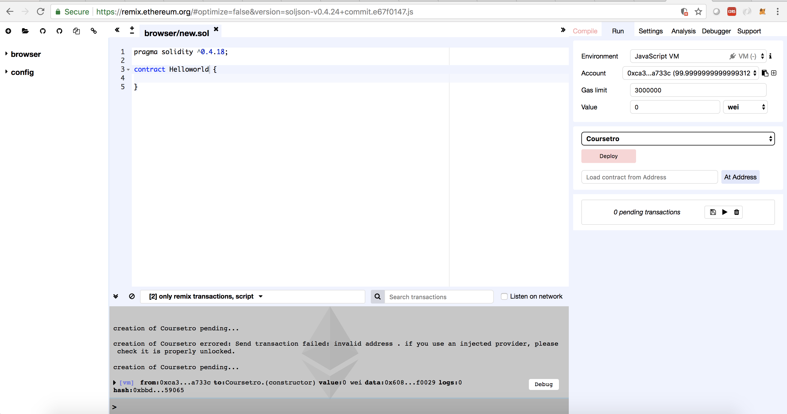
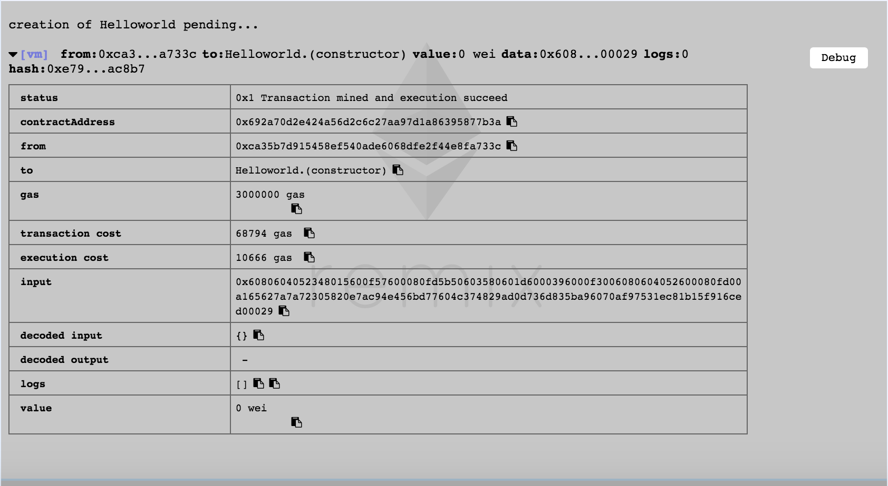

## Ethereum Basics (Variable types and Functions)
> we will use Remix IDE in this tutiorial

* Go to [Remix IDE](https://remix.ethereum.org/)
 
### What is Remix IDE
* Remix is a browser-based IDE built by the Ethereum development team.
* The purpose of the Remix IDE is to allow you to write and deploy Solidity smart contracts. It also provides you with useful debugging features.


* The left column contains your Solidity files, which store your smart contracts in the .sol format. In the middle column top row resides the area in which you write your solidity code, and the bottom row contains your debugger.

### Smart Contract Basics
* Click on the (+) icon on the upper left portion of the editor to create a new smart contract. Call it "Helloworld.sol", or whatever you wish to have.
* Basic Boiler code of slodity
```solidity
pragma solidity ^0.4.18;

contract Helloworld {
    
}
```
* The very first line defines the version of solidity you're going to use.
* Next, you define the contract and its name and open it up like a JavaScript class.
* Once you are done writting the smart contract, choose JavaScript VM as a environment then click on the deploy button in Remix IDE



* Click on details to provide you with more information


* Notice there's a contractAddress, this is where the smart contract actually lives. No, it's not live on the Ethereum Blockchain because right now, we're simply working within the Javascript EVM.

* Also notice gas. Every time a contract is deployed and modified, nodes on the Ethereum network must verify the contract. It's referred to as being redundantly parallel, as a way to reach consensus. 

* Gas is the name for the execution fee that senders of transactions (in our case, senders of a smart contract transaction) will pay for verification.