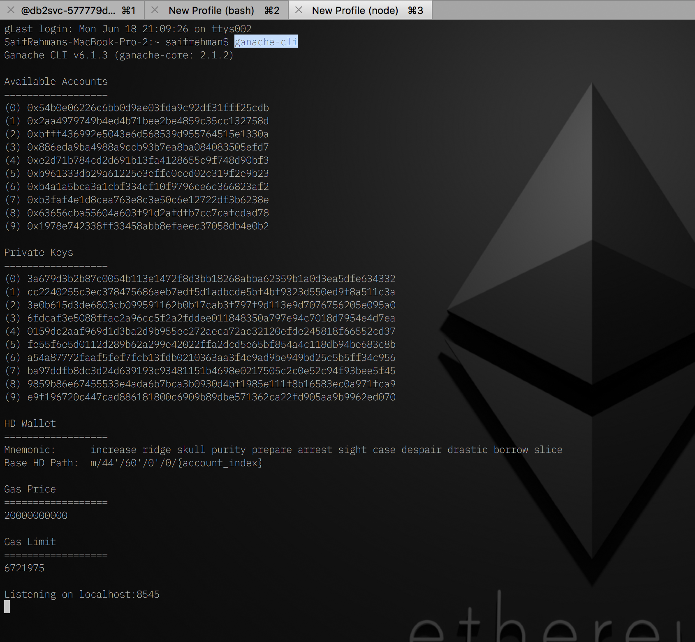
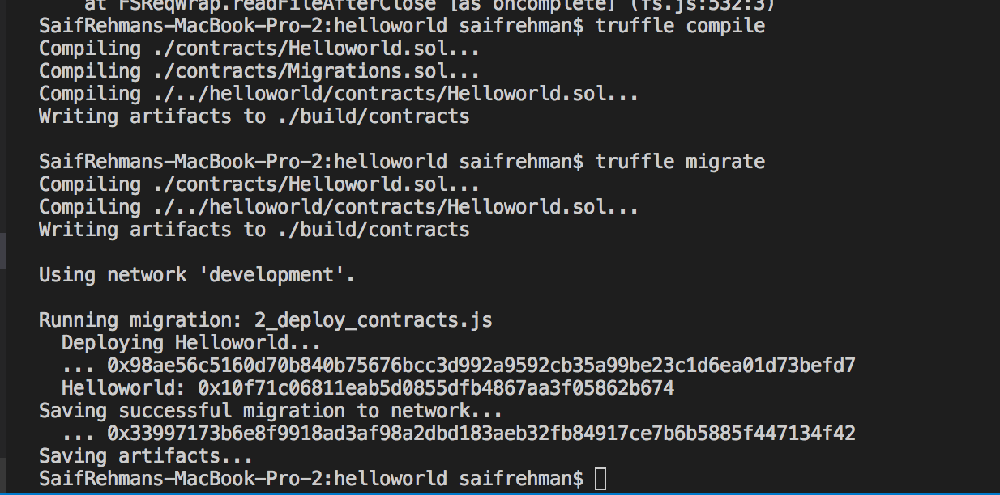
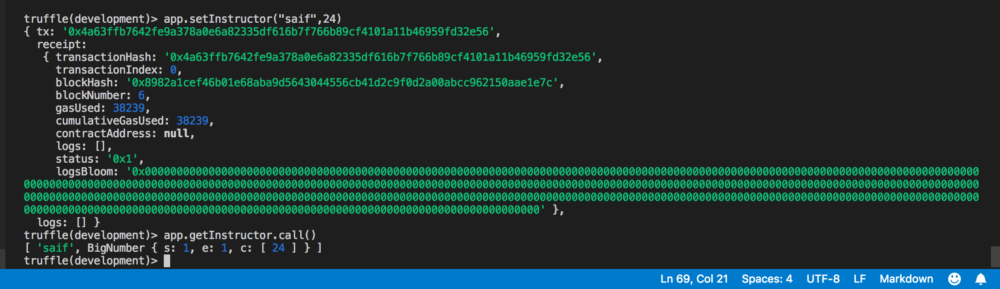

## Deploying smart contract to Ethereum Testnet (Ganache)

* Spin up ganache
```
$ ganache-cli
```


* Initialize truffle
```
$ truffle init
```
> This will generate a boiler plate code of solidity
* Create Helloworld.sol in contract folder and paste in following code we built earlier

``` Solidity
pragma solidity ^0.4.18;
contract Helloworld {
    
   string public fName ;
   uint public age ; // since age can not be nagative
     function setInstructor(string _fName, uint _age) public {
       fName = _fName;
       age = _age;
   }
   
   function getInstructor() public constant returns (string, uint) {
       return (fName, age);
   }
    
}
```

* Create 2_deploy_contracts.js in migrations folder and paste in the following code
```JavaScript
var Helloworld = artifacts.require("Helloworld")

module.exports = function(deployer) {
  deployer.deploy(Helloworld)
}
```

* At ```truffle.js``` file add the following lines under ```module.exports```
```JavaScript
  networks: {
    development: {
      host: "localhost",
      port: 8545,
      network_id: "*" // Match any network id
    }
  }
```

* Run 
```
$ truffle compile && truffle migrate
```



> you will see this, if everything is sucesfull 

* Run truffle console
```
$ truffle console
```  
> var app
> Helloworld.deployed().then(function(instance) { app = instance; })
> app.message.call()
> app.setInstructor("saif",24)
> app.getInstructor.call()


> On success !
* Note:- We use ```.call()``` to get data from blockchain, and when we need to write data on blockchain we do not use ```.call()```